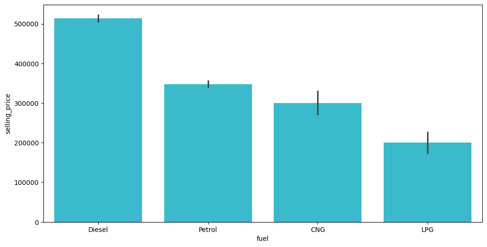

# Car Price Prediction - Data Cleaning & EDA

## Project Overview

This project demonstrates a complete data cleaning and exploratory data analysis (EDA) workflow using a Kaggle car price prediction dataset.

## Objectives

- Handle missing values
- Remove duplicate records
- Detect and treat outliers
- Explore feature distributions
- Analyze relationships between variables
- Prepare data for machine learning models

## Tools & Libraries

- Python
- Pandas
- NumPy
- Matplotlib
- Seaborn
- Google Colab

## Workflow

1. Dataset Loading
2. Data Cleaning
3. Missing Value Treatment
4. Duplicate Removal
5. Outlier Detection
6. Exploratory Data Analysis
7. Correlation Analysis
8. Key Insights

## Sample Visualizations

### Correlation Heatmap

### Selling Price Distribution

### Outlier Detection

## Key Findings

- Vehicle selling price increases with engine power.
- Newer vehicles generally have higher market value.
- Significant outliers were identified and removed using the IQR method.
- Missing values were successfully handled through imputation techniques.

## Files

- Car_Price_Prediction_Data_Cleaning_and_EDA.ipynb

## Author

- Ibrohim Khudoyberdiyev
- B.Sc. IT (Artificial Intelligence & Data Science) 
- Amity University Tashkent
